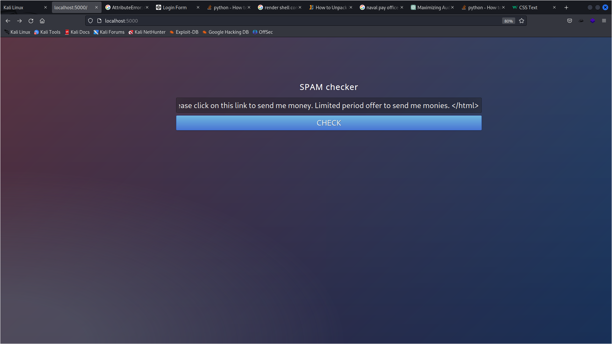
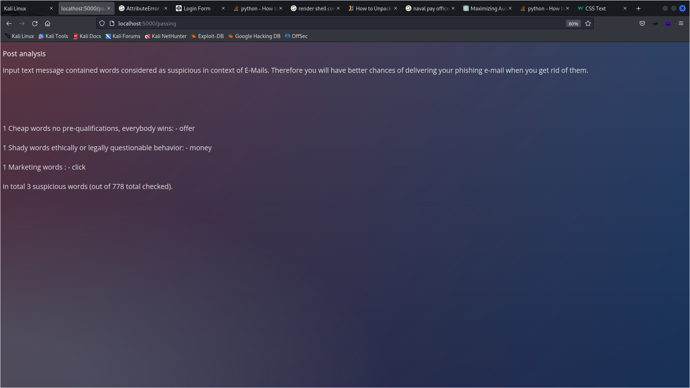

### What are email headers

Email headers are mainly used to obtain the entire history an email contains, including various security verifications.

Depending on your interest, email headers are important for various reasons. A sender would focus on analyzing the email metadata to improve deliverability and reputation. An admin would utilize fields during the server configuration process. And a recipient can analyze the email metadata to verify the legitimacy of the received email.

downloading mgeeky spam headers program

### mgeeky spam classifier
https://github.com/mgeeky/decode-spam-headers

### mgeeky linter
https://github.com/mgeeky/Penetration-Testing-Tools/blob/master/phishing/phishing-HTML-linter.py

using linter creating a website

sample taken from https://codepen.io/frytyler/pen/nJYVEO

# page created!

